# Markdown Feature Playground

> A deliberately feature-rich test document for VS Code Markdown preview.
>
> **Purpose:** test which Markdown, math, HTML, and Mermaid features render correctly in your current setup.

---

## Table of contents

- [Basic formatting](#basic-formatting)
- [Lists and task tracking](#lists-and-task-tracking)
- [Tables](#tables)
- [Code and configuration](#code-and-configuration)
- [Mathematics](#mathematics)
- [Links, images, footnotes, and HTML](#links-images-footnotes-and-html)
- [ASCII and box-drawing diagrams](#ascii-and-box-drawing-diagrams)
- [Quick visual test — Simple plot](#quick-visual-test--simple-plot)
- [Quick visual test — Simple flowchart](#quick-visual-test--simple-flowchart)
- [Mermaid node-coding reference](#mermaid-node-coding-reference)
- [Mermaid 1 — Complex trading architecture](#mermaid-1--complex-trading-architecture)
- [Mermaid 2 — Order lifecycle sequence](#mermaid-2--order-lifecycle-sequence)
- [Mermaid 3 — Strategy state machine](#mermaid-3--strategy-state-machine)
- [Mermaid 4 — Domain class model](#mermaid-4--domain-class-model)
- [Mermaid 5 — Data model](#mermaid-5--data-model)
- [Mermaid 6 — Experiment timeline](#mermaid-6--experiment-timeline)
- [Mermaid 7 — Knowledge map](#mermaid-7--knowledge-map)
- [Mermaid 8 — Strategy selection quadrant](#mermaid-8--strategy-selection-quadrant)
- [Mermaid 9 — Git history](#mermaid-9--git-history)
- [Mermaid 10 — Portfolio composition](#mermaid-10--portfolio-composition)
- [Mermaid 11 — Model performance](#mermaid-11--model-performance)
- [Mermaid 12 — User journey](#mermaid-12--user-journey)
- [Mermaid 13 — Project history timeline](#mermaid-13--project-history-timeline)
- [Mermaid 14 — Capital-flow Sankey](#mermaid-14--capital-flow-sankey)
- [Mermaid 15 — Requirements traceability](#mermaid-15--requirements-traceability)
- [Mermaid 16 — Block diagram](#mermaid-16--block-diagram)
- [Mermaid 17 — Kanban board](#mermaid-17--kanban-board)
- [Mermaid 18 — Packet layout](#mermaid-18--packet-layout)
- [Mermaid 19 — Architecture diagram](#mermaid-19--architecture-diagram)
- [Mermaid 20 — Strategy radar chart](#mermaid-20--strategy-radar-chart)
- [Mermaid 21 — Risk-budget treemap](#mermaid-21--risk-budget-treemap)
- [Mermaid 22 — C4 system context](#mermaid-22--c4-system-context)

---

## Basic formatting

Normal text can contain **bold**, *italic*, ***bold italic***, ~~strikethrough~~, `inline code`, and escaped characters such as \*literal asterisks\*.

Trading terminology can be defined inline:

- **Leader:** an account whose positions are observed.
- **Follower:** the portfolio replicating or transforming those positions.
- **Target exposure:** desired position after aggregation and risk controls.

> [!NOTE]
> GitHub and some VS Code extensions render this as a callout. Other renderers show an ordinary blockquote.

> [!WARNING]
> A diagram rendering correctly does not guarantee that every Markdown platform supports its Mermaid version.

> A standard blockquote can be nested:
>
> > “All models are wrong, but some are useful.”

---

## Lists and task tracking

1. Collect leader positions.
2. Normalize symbols and quantities.
   1. Resolve aliases.
   2. Convert contract sizes.
   3. Reject stale observations.
3. Aggregate signals.
4. Apply portfolio constraints.
5. Execute the delta.

Checklist:

- [x] Define canonical position representation
- [x] Add leader-level exposure limits
- [ ] Validate partial-closure detection
- [ ] Backtest correlated-leader penalty
- [ ] Document emergency shutdown procedure

Definition-style content using HTML:

<dl>
  <dt>Gross exposure</dt>
  <dd>Sum of the absolute values of all position notionals.</dd>
  <dt>Net exposure</dt>
  <dd>Signed sum of position notionals.</dd>
</dl>

---

## Tables

| Stage | Input | Output | Failure policy | Owner |
|:--|:--|:--|:--|--:|
| Scraping | Remote account state | Raw snapshot | Retry with backoff | Watcher |
| Normalization | Raw snapshot | Canonical positions | Quarantine invalid symbols | Preprocessor |
| Aggregation | Leader signals | Combined signal | Preserve previous target | Strategy |
| Risk | Combined signal | Constrained target | Reduce to safe exposure | Risk engine |
| Execution | Target delta | Orders and fills | Cancel or reconcile | Executor |

Compact performance comparison:

| Strategy | CAGR | Volatility | Sharpe | Max drawdown |
|---|---:|---:|---:|---:|
| Equal weight | 18.4% | 14.1% | 1.31 | −17.8% |
| Confidence weighted | 21.7% | 13.8% | **1.57** | −15.2% |
| Risk parity | 17.9% | **10.4%** | 1.49 | **−11.3%** |

### Formulas inside table cells

Display math (`$$...$$`) can be placed directly inside a table cell, which is a compact way to lay out a payoff matrix or side-by-side scenario comparison:

| Minimum PnL / size | Maximum PnL / size |
|---|---|
| $$ \color{#ffeebb} -\left[P_{high}(t_{close}) - P_{entry}\right] $$ | $$ \color{#ffeebb} -\left[P_{low}(t_{close}) - P_{entry}\right] $$ |
| $$ \color{#bbeeff} -\left[F(t_{close}) - F(t_{entry})\right] $$ | $$ \color{#bbeeff} -\left[F(t_{close}) - F(t_{entry})\right] $$ |

### Complex merged/styled tables (spreadsheet-style paste)

A table pasted from Google Sheets, or built with a table generator, usually arrives as raw HTML rather than pipe syntax: a `<style>` block defining per-class cell shading, `colspan`/`rowspan` for merged multi-level headers, `<br>` for in-cell line breaks, and colored emoji used as ad-hoc status markers. Whether this renders identically to a native Markdown table — or at all — depends heavily on the renderer, which is exactly why it is worth testing before converting slide content that contains tables like this.

<style type="text/css">
.pg  {border-collapse:collapse;border-spacing:0;}
.pg td, .pg th {border:1px solid #999; font-family:Arial, sans-serif; font-size:14px; padding:8px; text-align:center; vertical-align:middle;}
.pg .pg-head {background-color:#ffce93; font-weight:bold;}
.pg .pg-ok {background-color:#013300;}
</style>
<table class="pg"><thead>
  <tr>
    <th class="pg-head" colspan="2" rowspan="2"></th>
    <th class="pg-head" rowspan="2">No data<br>(never scraped)</th>
    <th class="pg-head" colspan="2">Data present</th>
  </tr>
  <tr>
    <th class="pg-head">Inactive</th>
    <th class="pg-head">Active</th>
  </tr>
</thead>
<tbody>
  <tr>
    <td class="pg-head" colspan="2">No history</td>
    <td>—</td>
    <td><span style="font-weight:300">🟡</span><br>Unexpected: data with no history</td>
    <td><span style="font-weight:400">🔴</span><br>Possible but incomplete</td>
  </tr>
  <tr>
    <td class="pg-head" rowspan="2">History</td>
    <td class="pg-head">No trades</td>
    <td>🟡<br>Unexpected combination</td>
    <td class="pg-ok">🟡<br>Rare but valid</td>
    <td class="pg-ok">✅<br>Just joined, active, no closes yet</td>
  </tr>
  <tr>
    <td class="pg-head">Has trades</td>
    <td>🔴<br>Can be incomplete</td>
    <td class="pg-ok">✅<br>Classic: has history, now inactive</td>
    <td class="pg-ok">✅<br>Classic: has history, currently active</td>
  </tr>
</tbody></table>

---

## Code and configuration

Python with syntax highlighting:

```python
from dataclasses import dataclass
from decimal import Decimal

@dataclass(frozen=True)
class Signal:
    symbol: str
    leader_id: str
    confidence: float
    target_notional: Decimal

def aggregate(signals: list[Signal]) -> dict[str, Decimal]:
    totals: dict[str, Decimal] = {}
    for signal in signals:
        weighted = signal.target_notional * Decimal(str(signal.confidence))
        totals[signal.symbol] = totals.get(signal.symbol, Decimal(0)) + weighted
    return totals
```

YAML configuration:

```yaml
strategy:
  name: confidence-weighted-following
  aggregation:
    minimum_leaders: 3
    correlation_penalty: 0.35
  risk:
    maximum_gross_exposure: 1.50
    maximum_symbol_exposure: 0.20
    daily_loss_limit: 0.025
  execution:
    order_type: adaptive_limit
    maximum_slippage_bps: 12
```

JSON event:

```json
{
  "event": "target.changed",
  "symbol": "BTC-USD",
  "previous": 0.18,
  "target": 0.23,
  "causes": ["leader_open", "confidence_update"]
}
```

Shell command:

```bash
pytest -q tests/strategy tests/risk --maxfail=1
```

---

## Mathematics

Inline math: the simple return is $r_t = \frac{P_t}{P_{t-1}} - 1$.

### Weighted signal

$$
S_{a,t} =
\frac{
  \displaystyle\sum_{i=1}^{N} q_{i,a,t}\,c_{i,t}\,w_{i,t}
}{
  \displaystyle\sum_{i=1}^{N} c_{i,t}\,w_{i,t} + \varepsilon
}
$$

### Correlation-adjusted leader weight

$$
\tilde{w}_i =
\frac{
  w_i \exp\!\left(-\lambda \sum_{j \ne i} w_j\max(0,\rho_{ij})\right)
}{
  \displaystyle\sum_{k=1}^{N}
  w_k \exp\!\left(-\lambda \sum_{j \ne k}w_j\max(0,\rho_{kj})\right)
}
$$

### Constrained portfolio optimization

$$
\begin{aligned}
\mathbf{x}^{\star}
&= \arg\min_{\mathbf{x}}
\left[
  \frac{1}{2}(\mathbf{x}-\mathbf{s})^{\top}\Sigma(\mathbf{x}-\mathbf{s})
  + \gamma\lVert\mathbf{x}-\mathbf{x}_{t-1}\rVert_1
\right] \\
\text{subject to}\quad
&\lVert\mathbf{x}\rVert_1 \le G_{\max}, \\
&\left|x_a\right| \le L_a \quad \forall a, \\
&\mathbf{b}^{\top}\mathbf{x} \in [B_{\min}, B_{\max}].
\end{aligned}
$$

### Piecewise transaction-cost model

$$
C(\Delta x) =
\begin{cases}
0, & |\Delta x| < \delta, \\
c_1|\Delta x|, & \delta \le |\Delta x| < V, \\
c_1V + c_2(|\Delta x|-V)^{3/2}, & |\Delta x| \ge V.
\end{cases}
$$

### Colored equations (multi-term breakdown)

Individual terms of a formula can be colored to visually separate its components — useful for breaking a PnL calculation down into its constituent parts:

$$
\begin{aligned}
PnL(t) = & \color{#ffee55}{S \cdot \beta_{side} \cdot (P_{close} - P_{entry})} & \color{#ffee55}{\text{(Raw PnL)}} \\
       - & \color{#55eeff}{S \cdot \beta_{side} \cdot \textstyle\sum_{u} f(u)} & \color{#55eeff}{\text{(Funding)}} \\
       - & \color{#ff55ee}{S \cdot r_{fee} \cdot (P_{close} + P_{entry})} & \color{#ff55ee}{\text{(Fees)}}
\end{aligned}
$$

Both named colors (`\color{red}`) and hex colors (`\color{#ffee55}`) work, and a color can be reopened partway through a line to highlight a single symbol without recoloring the rest of the expression:

$$ \color{#ffeebb} PnL_{min} = \left[ \color{red}{P_{low}(t_{close})} \color{#ffeebb}{- P_{entry}} \right] $$

### Numbered equation environments with case labels

`\begin{equation}...\end{equation}` around `\begin{cases}` produces a numbered, cased formula with inline text labels per branch — heavier than a bare `$$` block, but common in formal derivation notebooks:

\begin{equation}
  RoM =
    \begin{cases}
      L \cdot \dfrac{P_{mark} - P_{entry}}{P_{entry}} & \text{for a Long position}\\
      L \cdot \dfrac{P_{entry} - P_{mark}}{P_{entry}} & \text{for a Short position}
    \end{cases}
\end{equation}

### Boxing a conclusion

`\boxed{...}` highlights a final result. It is also used informally around plain text rather than a formula, to flag a conclusion at a glance while scanning a long derivation:

$$ \boxed{S^t > S^0} $$

$$ \boxed{\text{IMPOSSIBLE}} $$

---

## Links, images, footnotes, and HTML

- External link: [Mermaid documentation](https://mermaid.js.org/)
- Relative link example: [`../src/strategy/aggregation.py`](../src/strategy/aggregation.py)
- Automatic URL: <https://code.visualstudio.com/>
- Footnote reference.[^staleness]

[^staleness]: Documentation becomes stale when the implementation changes without an accompanying documentation update.

An image with a title and alt text:

```markdown

```

<details>
<summary><strong>Click to reveal implementation notes</strong></summary>

This section uses native HTML. It may render as a collapsible disclosure in the VS Code preview.

```text
The Markdown inside an HTML block may depend on the renderer.
```

</details>

Keyboard-style HTML: press <kbd>Cmd</kbd> + <kbd>Shift</kbd> + <kbd>V</kbd> to open the preview.

Highlighted HTML text: <mark>this may depend on the renderer and CSS</mark>.

### Local images with explicit sizing

Plain `` syntax has no size control. Raw `` does, and can be paired with `<br/>` to stack images vertically without an intervening paragraph break:

```markdown

<br/>

```

### Manual HTML callout boxes

Before relying on `> [!NOTE]`-style callouts, a background-colored `<div>` is a common hand-rolled way to set a derivation or aside visually apart from the surrounding text:

<div style='background-color: #444; padding: 10px; margin-bottom: 20px;'>

$$ \Delta M = S \cdot P_{entry} \left[ \frac{1}{L^t} - \frac{1}{L^0} \right] $$

</div>

### Inline colored warning text

`<span style="color:...">` combined with `<b>` and a leading emoji is a manual alternative to a blockquote callout, for a single inline warning rather than a whole block:

<span style='color: #F77;'><b>
⚠ Assumes $P_{mark}$ stays within tolerance $\frac{1}{L+1}$ of $P_{last}$.
</b></span>

---

## ASCII and box-drawing diagrams

Before reaching for Mermaid, a plain box-drawing diagram inside a code fence is a lighter-weight way to sketch architecture or data flow — no renderer required, degrades gracefully to plain text in any viewer, and is trivial to keep in sync by hand for a quick note.

```text
                    ┌──────────────────────────┐
                    │        DATA_ARCHIVE      │
                    │    (shared NAS storage)  │
                    └──────────────────────────┘
                       ▲              ▲
                       │ archive      │ archive
        ┌───────────────────────┐   ┌───────────────────────┐
        │        Laptop         │   │      VM (H-Frank-1)   │
        │  DATA_LOCAL = /Users  │   │  DATA_LOCAL = /home   │
        │    dev/               │   │    prod/leader_sel/   │
        │    prod/leader_se_v5/ │   │      lib/  conf/      │
        └───────────────────────┘   └───────────────────────┘
```

---

## Quick visual test — Simple plot

This intentionally simple chart lets you confirm immediately that your Mermaid renderer supports `xychart-beta`.

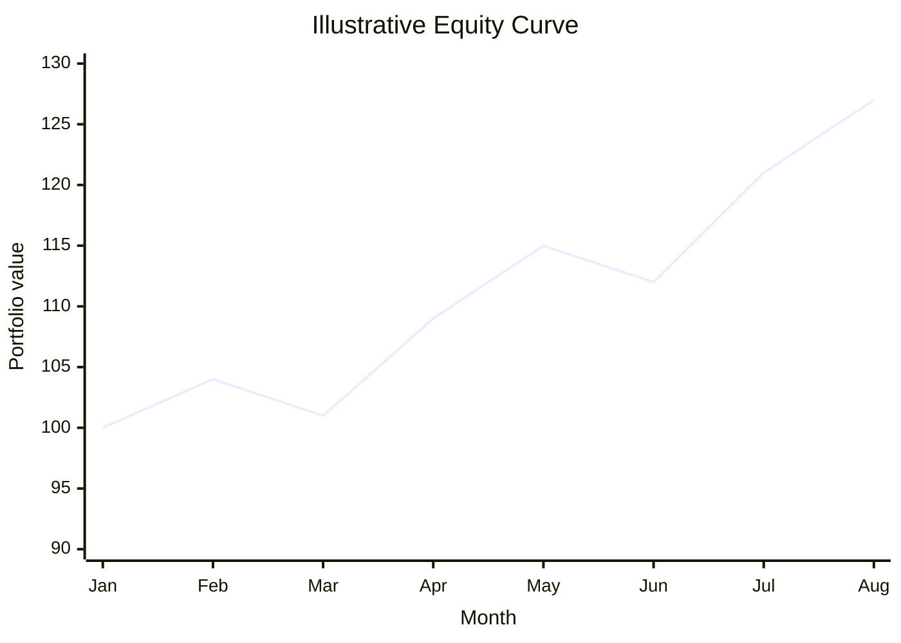
```mermaid
xychart-beta
    title "Illustrative Equity Curve"
    x-axis "Month" [Jan, Feb, Mar, Apr, May, Jun, Jul, Aug]
    y-axis "Portfolio value" 90 --> 130
    line [100, 104, 101, 109, 115, 112, 121, 127]
```

> The values are illustrative test data, not actual strategy results.

---

## Quick visual test — Simple flowchart

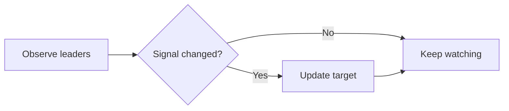
```mermaid
flowchart LR
    Observe[Observe leaders] --> Decide{Signal changed?}
    Decide -->|Yes| Trade[Update target]
    Decide -->|No| Wait[Keep watching]
    Trade --> Wait
```

This is close to the smallest useful decision flowchart: four nodes, one decision, labelled branches, and a feedback path.

---

## Mermaid node-coding reference

### Common flowchart node shapes

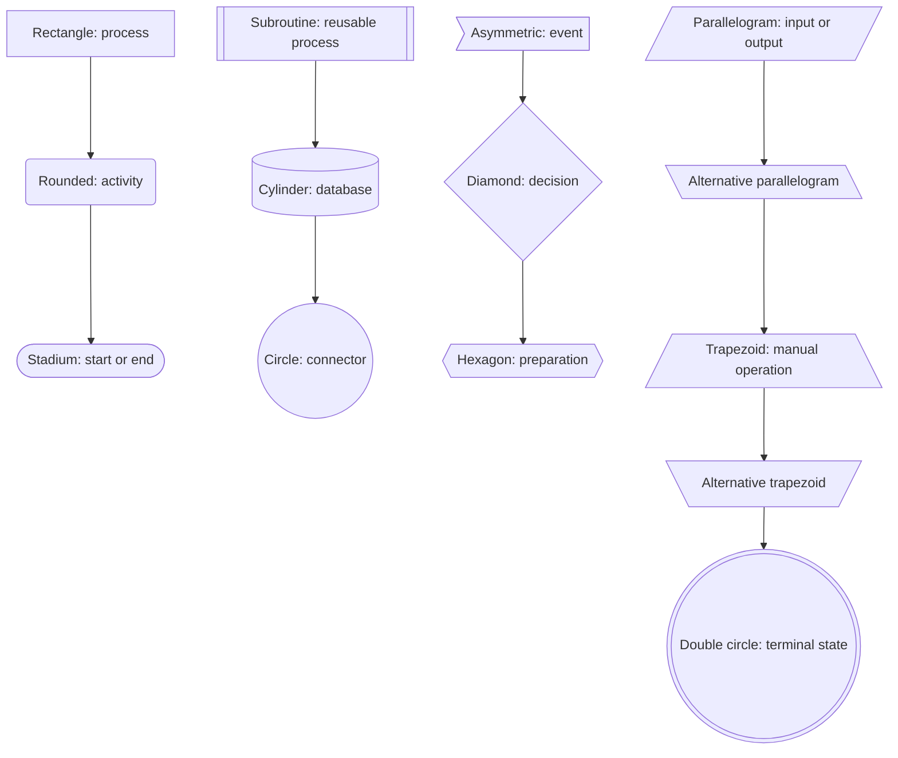
```mermaid
flowchart TB
    A[Rectangle: process]
    B(Rounded: activity)
    C([Stadium: start or end])
    D[[Subroutine: reusable process]]
    E[(Cylinder: database)]
    F((Circle: connector))
    G>Asymmetric: event]
    H{Diamond: decision}
    I{{Hexagon: preparation}}
    J[/Parallelogram: input or output/]
    K[\Alternative parallelogram\]
    L[/Trapezoid: manual operation\]
    M[\Alternative trapezoid/]
    N(((Double circle: terminal state)))

    A --> B --> C
    D --> E --> F
    G --> H --> I
    J --> K --> L --> M --> N
```

### Edge and arrow vocabulary

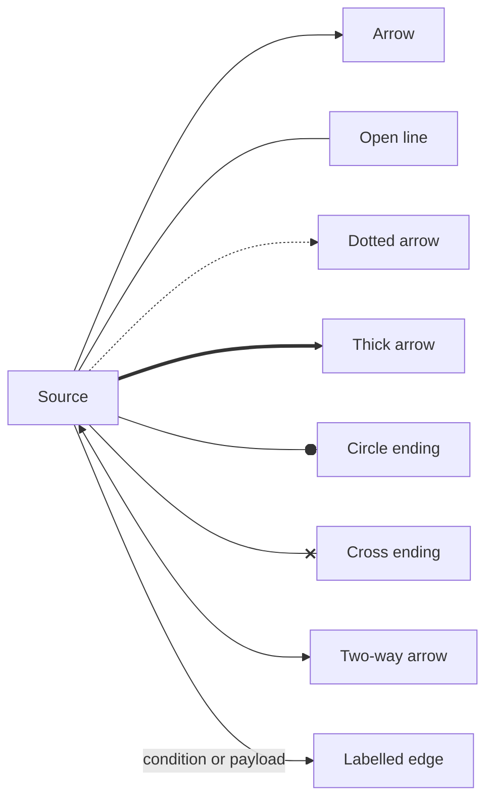
```mermaid
flowchart LR
    A[Source]
    B[Arrow]
    C[Open line]
    D[Dotted arrow]
    E[Thick arrow]
    F[Circle ending]
    G[Cross ending]
    H[Two-way arrow]
    I[Labelled edge]

    A --> B
    A --- C
    A -.-> D
    A ==> E
    A --o F
    A --x G
    A <--> H
    A -->|condition or payload| I
```

### Subgraphs, direction, classes, styles, and link styling

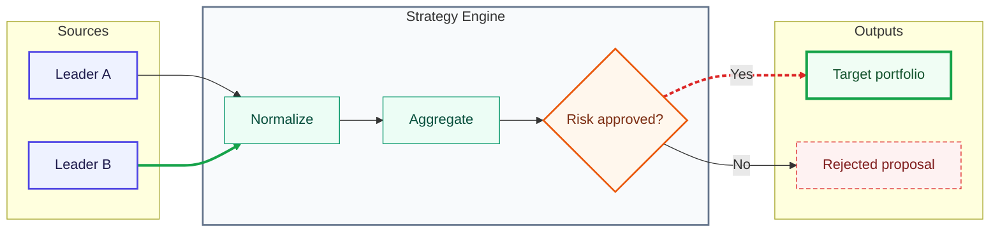
```mermaid
flowchart LR
    subgraph SOURCE[Sources]
        direction TB
        L1[Leader A]
        L2[Leader B]
    end

    subgraph ENGINE[Strategy Engine]
        direction TB
        N[Normalize]
        A[Aggregate]
        R{Risk approved?}
        N --> A --> R
    end

    subgraph OUTPUT[Outputs]
        direction TB
        T[Target portfolio]
        X[Rejected proposal]
    end

    L1 --> N
    L2 --> N
    R -->|Yes| T
    R -->|No| X

    classDef source fill:#eef2ff,stroke:#4f46e5,color:#1e1b4b,stroke-width:2px;
    classDef process fill:#ecfdf5,stroke:#059669,color:#064e3b;
    classDef decision fill:#fff7ed,stroke:#ea580c,color:#7c2d12,stroke-width:2px;
    classDef success fill:#f0fdf4,stroke:#16a34a,color:#14532d,stroke-width:3px;
    classDef failure fill:#fef2f2,stroke:#dc2626,color:#7f1d1d,stroke-dasharray: 5 3;

    class L1,L2 source;
    class N,A process;
    class R decision;
    class T success;
    class X failure;

    style ENGINE fill:#f8fafc,stroke:#64748b,stroke-width:2px
    linkStyle 3 stroke:#16a34a,stroke-width:3px
    linkStyle 4 stroke:#dc2626,stroke-width:3px,stroke-dasharray:5 3
```

### Chained declarations and multidirectional layout

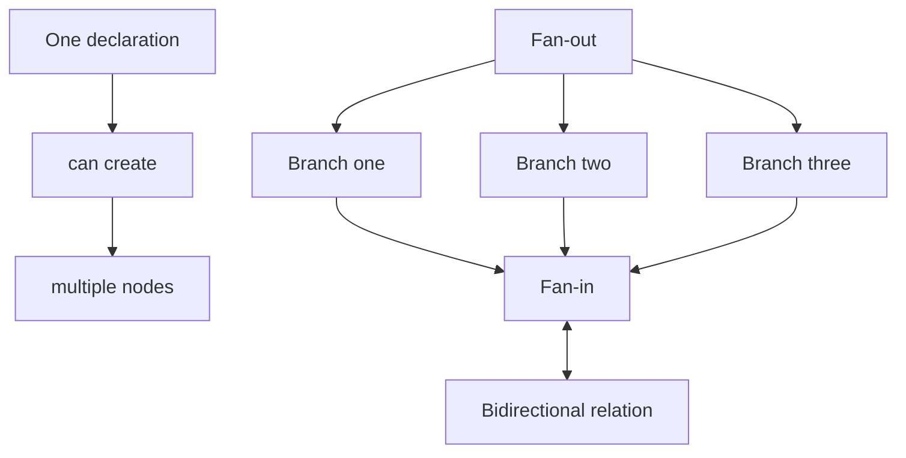
```mermaid
flowchart TD
    A[One declaration] --> B[can create] --> C[multiple nodes]
    D[Fan-out] --> E[Branch one] & F[Branch two] & G[Branch three]
    E & F & G --> H[Fan-in]
    H <--> I[Bidirectional relation]
```

---

## Mermaid 1 — Complex trading architecture

This is the primary stress test. It includes subgraphs, several node shapes, databases, queues, decision points, feedback loops, edge labels, classes, and cross-layer connections.

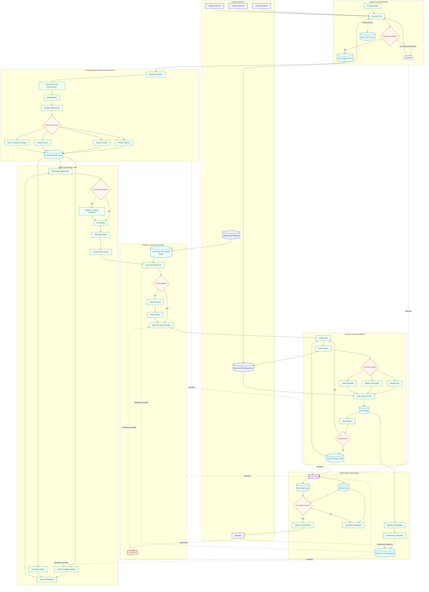
```mermaid
flowchart TB
    subgraph EXT[External Systems]
        direction LR
        L1[Leader Account A]
        L2[Leader Account B]
        L3[Leader Account N]
        EX[(Broker and Exchange APIs)]
        MD[(Market Data Providers)]
        OPS[Operator]
    end

    subgraph ING[Ingestion and Observation]
        direction LR
        SCH{{Scheduler}}
        W1[Watcher Pool]
        PX[Proxy Manager]
        RL{Rate limit available?}
        RAW[(Raw Snapshot Store)]
        DLQ[(Dead Letter Queue)]

        SCH --> W1
        PX --> W1
        W1 --> RL
        RL -- Yes --> RAW
        RL -->|No: exponential backoff| SCH
        W1 -. invalid payload .-> DLQ
    end

    subgraph PRE[Preprocessing and State Reconstruction]
        direction LR
        VAL[Schema Validation]
        NORM[Symbol and Unit Normalization]
        DEDUP[Deduplication]
        DIFF[Snapshot Differencing]
        EVT{Event Classification}
        OPEN[Position Opened]
        CLOSE[Position Closed]
        PART[Partial Closure]
        MODIFY[Size or Leverage Changed]
        STATE[(Canonical Leader State)]

        VAL --> NORM --> DEDUP --> DIFF --> EVT
        EVT --> OPEN
        EVT --> CLOSE
        EVT --> PART
        EVT --> MODIFY
        OPEN --> STATE
        CLOSE --> STATE
        PART --> STATE
        MODIFY --> STATE
    end

    subgraph SIG[Signal and Strategy Layer]
        direction LR
        SCORE[Leader Reliability Scoring]
        CORR[Correlation Graph]
        WEIGHT[Dynamic Weighting]
        AGG[Multi-leader Aggregation]
        CONFLICT{Conflicting directions?}
        NET[Net Signals]
        ABSTAIN[Abstain or Reduce Confidence]
        SAT[Saturation Model]
        TARGET[Unconstrained Targets]

        SCORE --> WEIGHT
        CORR --> WEIGHT
        STATE --> AGG
        WEIGHT --> AGG --> CONFLICT
        CONFLICT -- No --> NET
        CONFLICT -- Yes --> ABSTAIN --> NET
        NET --> SAT --> TARGET
    end

    subgraph RISK[Portfolio Construction and Risk]
        direction LR
        COV[(Covariance and Liquidity Model)]
        OPT[Constrained Optimizer]
        LIMITS{Limits satisfied?}
        SCALE[Scale Positions]
        SAFE[Safe Portfolio]
        KILL{{Kill Switch}}
        APPROVE[Approved Target Portfolio]

        TARGET --> OPT
        COV --> OPT
        OPT --> LIMITS
        LIMITS -- Yes --> APPROVE
        LIMITS -- No --> SCALE --> SAFE --> APPROVE
        KILL -. Emergency override .-> APPROVE
    end

    subgraph EXEC[Execution and Reconciliation]
        direction LR
        CURRENT[(Current Follower State)]
        DELTA[Target Delta]
        PLAN[Order Planner]
        ROUTE{Execution Route}
        MARKET[Market Order]
        LIMIT[Adaptive Limit Order]
        TWAP[TWAP Schedule]
        OMS[Order State Machine]
        FILL[(Fills Ledger)]
        RECON[Reconciliation]
        DRIFT{Material drift?}

        APPROVE --> DELTA
        CURRENT --> DELTA --> PLAN --> ROUTE
        ROUTE --> MARKET
        ROUTE --> LIMIT
        ROUTE --> TWAP
        MARKET --> OMS
        LIMIT --> OMS
        TWAP --> OMS
        OMS --> FILL --> RECON --> DRIFT
        DRIFT -- Yes --> DELTA
        DRIFT -- No --> CURRENT
    end

    subgraph OBS[Observability and Learning]
        direction LR
        BUS[[Event Bus]]
        MET[(Metrics Store)]
        LOG[(Structured Logs)]
        ALERT{Anomaly detected?}
        PAGE[Pager and Notification]
        DASH[Operations Dashboard]
        BT[Backtest and Replay]
        EVAL[Performance Evaluation]
        REG[(Model and Config Registry)]

        BUS --> MET --> DASH
        BUS --> LOG
        MET --> ALERT
        LOG --> ALERT
        ALERT -- Yes --> PAGE --> OPS
        FILL --> BT --> EVAL --> REG
        ALERT -- No --> DASH
    end

    L1 --> W1
    L2 --> W1
    L3 --> W1
    W1 <--> EX
    MD --> COV
    RAW --> VAL
    STATE --> SCORE
    STATE --> CORR
    REG -. Updated parameters .-> SCORE
    REG -. Updated constraints .-> OPT
    PLAN <--> EX
    EX --> OMS
    ING -. telemetry .-> BUS
    PRE -. telemetry .-> BUS
    SIG -. telemetry .-> BUS
    RISK -. telemetry .-> BUS
    EXEC -. telemetry .-> BUS
    OPS -. manual halt .-> KILL
    OPS -. configuration approval .-> REG

    classDef external fill:#eef2ff,stroke:#4f46e5,stroke-width:2px,color:#1e1b4b;
    classDef storage fill:#ecfeff,stroke:#0891b2,stroke-width:2px,color:#164e63;
    classDef decision fill:#fff7ed,stroke:#ea580c,stroke-width:2px,color:#7c2d12;
    classDef process fill:#f0fdf4,stroke:#16a34a,stroke-width:1.5px,color:#14532d;
    classDef danger fill:#fef2f2,stroke:#dc2626,stroke-width:3px,color:#7f1d1d;
    classDef event fill:#faf5ff,stroke:#9333ea,stroke-width:2px,color:#581c87;

    class L1,L2,L3,EX,MD,OPS external;
    class RAW,DLQ,STATE,COV,CURRENT,FILL,MET,LOG,REG storage;
    class RL,EVT,CONFLICT,LIMITS,ROUTE,DRIFT,ALERT decision;
    class SCH,BUS event;
    class KILL danger;
    class W1,PX,VAL,NORM,DEDUP,DIFF,OPEN,CLOSE,PART,MODIFY,SCORE,CORR,WEIGHT,AGG,NET,ABSTAIN,SAT,TARGET,OPT,SCALE,SAFE,APPROVE,DELTA,PLAN,MARKET,LIMIT,TWAP,OMS,RECON,PAGE,DASH,BT,EVAL process;
```

---

## Mermaid 2 — Order lifecycle sequence

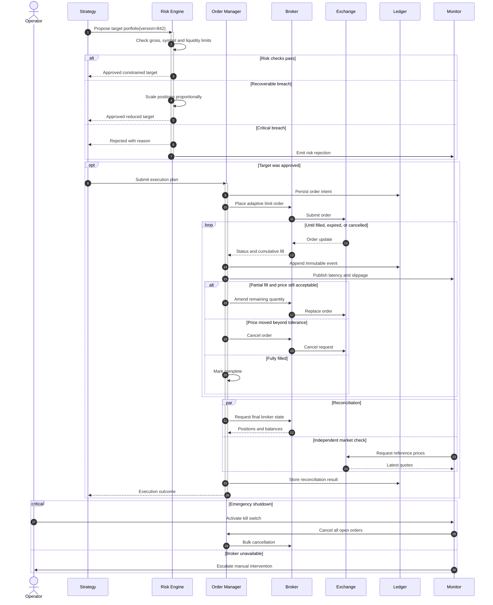
```mermaid
sequenceDiagram
    autonumber
    actor Operator
    participant Strategy
    participant Risk as Risk Engine
    participant OMS as Order Manager
    participant Broker
    participant Exchange
    participant Ledger
    participant Monitor

    Strategy->>Risk: Propose target portfolio(version=842)
    activate Risk
    Risk->>Risk: Check gross, symbol and liquidity limits

    alt Risk checks pass
        Risk-->>Strategy: Approved constrained target
    else Recoverable breach
        Risk->>Risk: Scale positions proportionally
        Risk-->>Strategy: Approved reduced target
    else Critical breach
        Risk-->>Strategy: Rejected with reason
        Risk->>Monitor: Emit risk rejection
    end
    deactivate Risk

    opt Target was approved
        Strategy->>OMS: Submit execution plan
        activate OMS
        OMS->>Ledger: Persist order intent
        OMS->>Broker: Place adaptive limit order
        Broker->>Exchange: Submit order

        loop Until filled, expired, or cancelled
            Exchange-->>Broker: Order update
            Broker-->>OMS: Status and cumulative fill
            OMS->>Ledger: Append immutable event
            OMS->>Monitor: Publish latency and slippage

            alt Partial fill and price still acceptable
                OMS->>Broker: Amend remaining quantity
                Broker->>Exchange: Replace order
            else Price moved beyond tolerance
                OMS->>Broker: Cancel order
                Broker->>Exchange: Cancel request
            else Fully filled
                OMS->>OMS: Mark complete
            end
        end

        par Reconciliation
            OMS->>Broker: Request final broker state
            Broker-->>OMS: Positions and balances
        and Independent market check
            Monitor->>Exchange: Request reference prices
            Exchange-->>Monitor: Latest quotes
        end

        OMS->>Ledger: Store reconciliation result
        OMS-->>Strategy: Execution outcome
        deactivate OMS
    end

    critical Emergency shutdown
        Operator->>Monitor: Activate kill switch
        Monitor->>OMS: Cancel all open orders
        OMS->>Broker: Bulk cancellation
    option Broker unavailable
        Monitor->>Operator: Escalate manual intervention
    end
```

---

## Mermaid 3 — Strategy state machine

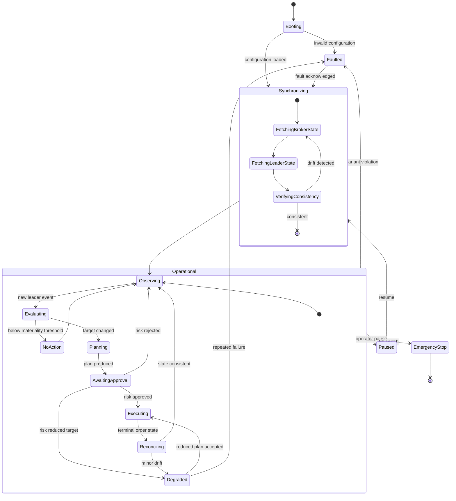
```mermaid
stateDiagram-v2
    [*] --> Booting
    Booting --> Synchronizing: configuration loaded
    Booting --> Faulted: invalid configuration

    state Synchronizing {
        [*] --> FetchingBrokerState
        FetchingBrokerState --> FetchingLeaderState
        FetchingLeaderState --> VerifyingConsistency
        VerifyingConsistency --> [*]: consistent
        VerifyingConsistency --> FetchingBrokerState: drift detected
    }

    Synchronizing --> Observing

    state Operational {
        [*] --> Observing
        Observing --> Evaluating: new leader event
        Evaluating --> NoAction: below materiality threshold
        Evaluating --> Planning: target changed
        NoAction --> Observing
        Planning --> AwaitingApproval: plan produced
        AwaitingApproval --> Executing: risk approved
        AwaitingApproval --> Degraded: risk reduced target
        AwaitingApproval --> Observing: risk rejected
        Degraded --> Executing: reduced plan accepted
        Executing --> Reconciling: terminal order state
        Reconciling --> Observing: state consistent
        Reconciling --> Degraded: minor drift
    }

    Observing --> Operational
    Operational --> Paused: operator pause
    Paused --> Synchronizing: resume
    Operational --> Faulted: invariant violation
    Operational --> EmergencyStop: kill switch
    Degraded --> Faulted: repeated failure
    Faulted --> Synchronizing: fault acknowledged
    EmergencyStop --> [*]
```

---

## Mermaid 4 — Domain class model

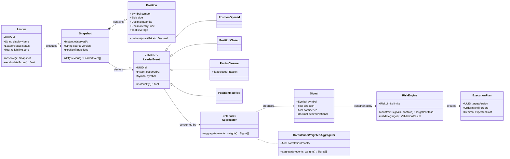
```mermaid
classDiagram
    direction LR

    class Leader {
        +UUID id
        +String displayName
        +LeaderStatus status
        +float reliabilityScore
        +observe() Snapshot
        +recalculateScore() float
    }

    class Snapshot {
        +Instant observedAt
        +String sourceVersion
        +Position[] positions
        +diff(previous) LeaderEvent[]
    }

    class Position {
        +Symbol symbol
        +Side side
        +Decimal quantity
        +Decimal entryPrice
        +float leverage
        +notional(markPrice) Decimal
    }

    class LeaderEvent {
        <<abstract>>
        +UUID id
        +Instant occurredAt
        +Symbol symbol
        +materiality() float
    }

    class PositionOpened
    class PositionClosed
    class PartialClosure {
        +float closedFraction
    }
    class PositionModified

    class Signal {
        +Symbol symbol
        +float direction
        +float confidence
        +Decimal desiredNotional
    }

    class Aggregator {
        <<interface>>
        +aggregate(events, weights) Signal[]
    }

    class ConfidenceWeightedAggregator {
        +float correlationPenalty
        +aggregate(events, weights) Signal[]
    }

    class RiskEngine {
        +RiskLimits limits
        +constrain(signals, portfolio) TargetPortfolio
        +validate(target) ValidationResult
    }

    class ExecutionPlan {
        +UUID targetVersion
        +OrderIntent[] orders
        +Decimal expectedCost
    }

    Leader "1" --> "0..*" Snapshot : produces
    Snapshot "1" *-- "0..*" Position : contains
    Snapshot --> "0..*" LeaderEvent : derives
    LeaderEvent <|-- PositionOpened
    LeaderEvent <|-- PositionClosed
    LeaderEvent <|-- PartialClosure
    LeaderEvent <|-- PositionModified
    Aggregator <|.. ConfidenceWeightedAggregator
    LeaderEvent --> Aggregator : consumed by
    Aggregator --> Signal : produces
    Signal --> RiskEngine : constrained by
    RiskEngine --> ExecutionPlan : creates
```

---

## Mermaid 5 — Data model

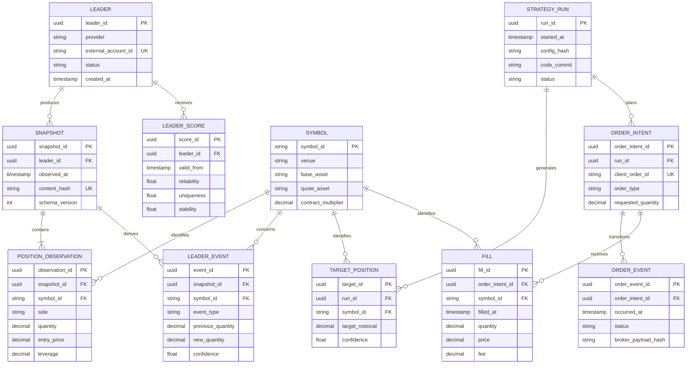
```mermaid
erDiagram
    LEADER ||--o{ SNAPSHOT : produces
    SNAPSHOT ||--|{ POSITION_OBSERVATION : contains
    LEADER ||--o{ LEADER_SCORE : receives
    SNAPSHOT ||--o{ LEADER_EVENT : derives
    SYMBOL ||--o{ POSITION_OBSERVATION : identifies
    SYMBOL ||--o{ LEADER_EVENT : concerns
    STRATEGY_RUN ||--o{ TARGET_POSITION : generates
    SYMBOL ||--o{ TARGET_POSITION : identifies
    STRATEGY_RUN ||--o{ ORDER_INTENT : plans
    ORDER_INTENT ||--o{ ORDER_EVENT : transitions
    ORDER_INTENT ||--o{ FILL : receives
    SYMBOL ||--o{ FILL : identifies

    LEADER {
        uuid leader_id PK
        string provider
        string external_account_id UK
        string status
        timestamp created_at
    }

    SNAPSHOT {
        uuid snapshot_id PK
        uuid leader_id FK
        timestamp observed_at
        string content_hash UK
        int schema_version
    }

    POSITION_OBSERVATION {
        uuid observation_id PK
        uuid snapshot_id FK
        string symbol_id FK
        string side
        decimal quantity
        decimal entry_price
        decimal leverage
    }

    LEADER_EVENT {
        uuid event_id PK
        uuid snapshot_id FK
        string symbol_id FK
        string event_type
        decimal previous_quantity
        decimal new_quantity
        float confidence
    }

    LEADER_SCORE {
        uuid score_id PK
        uuid leader_id FK
        timestamp valid_from
        float reliability
        float uniqueness
        float stability
    }

    SYMBOL {
        string symbol_id PK
        string venue
        string base_asset
        string quote_asset
        decimal contract_multiplier
    }

    STRATEGY_RUN {
        uuid run_id PK
        timestamp started_at
        string config_hash
        string code_commit
        string status
    }

    TARGET_POSITION {
        uuid target_id PK
        uuid run_id FK
        string symbol_id FK
        decimal target_notional
        float confidence
    }

    ORDER_INTENT {
        uuid order_intent_id PK
        uuid run_id FK
        string client_order_id UK
        string order_type
        decimal requested_quantity
    }

    ORDER_EVENT {
        uuid order_event_id PK
        uuid order_intent_id FK
        timestamp occurred_at
        string status
        string broker_payload_hash
    }

    FILL {
        uuid fill_id PK
        uuid order_intent_id FK
        string symbol_id FK
        timestamp filled_at
        decimal quantity
        decimal price
        decimal fee
    }
```

---

## Mermaid 6 — Experiment timeline

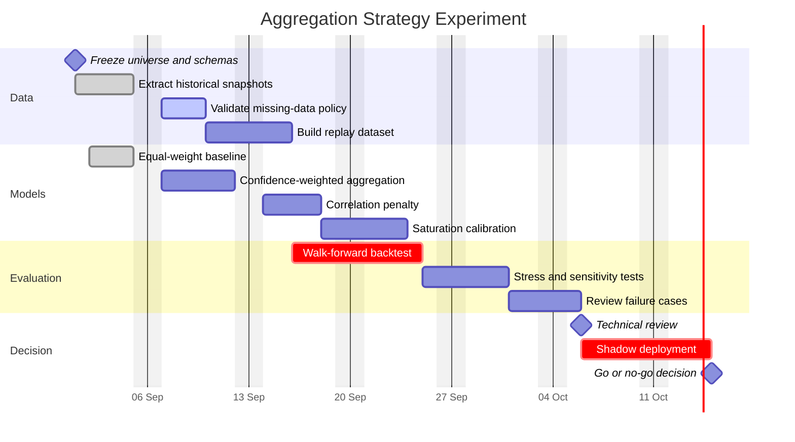
```mermaid
gantt
    title Aggregation Strategy Experiment
    dateFormat  YYYY-MM-DD
    axisFormat  %d %b
    excludes    weekends

    section Data
    Freeze universe and schemas       :milestone, m1, 2026-09-01, 0d
    Extract historical snapshots      :done, data1, 2026-09-01, 4d
    Validate missing-data policy      :active, data2, after data1, 3d
    Build replay dataset              :data3, after data2, 4d

    section Models
    Equal-weight baseline             :done, model1, 2026-09-02, 3d
    Confidence-weighted aggregation   :model2, after model1, 5d
    Correlation penalty               :model3, after model2, 4d
    Saturation calibration            :model4, after model3, 4d

    section Evaluation
    Walk-forward backtest             :crit, eval1, after data3, 7d
    Stress and sensitivity tests      :eval2, after eval1, 4d
    Review failure cases              :eval3, after eval2, 3d

    section Decision
    Technical review                  :milestone, m2, after eval3, 0d
    Shadow deployment                 :crit, deploy1, after m2, 7d
    Go or no-go decision              :milestone, m3, after deploy1, 0d
```

---

## Mermaid 7 — Knowledge map

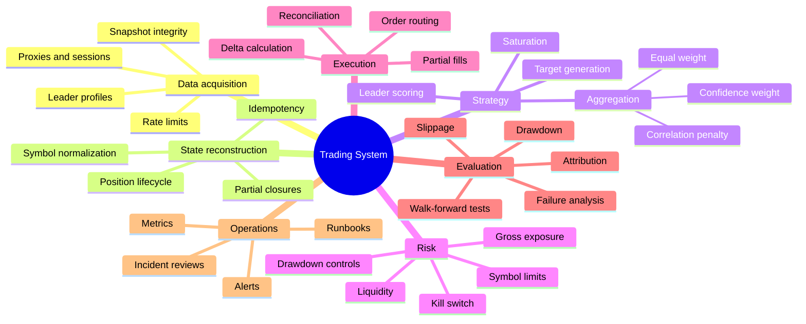
```mermaid
mindmap
  root((Trading System))
    Data acquisition
      Leader profiles
      Proxies and sessions
      Rate limits
      Snapshot integrity
    State reconstruction
      Symbol normalization
      Position lifecycle
      Partial closures
      Idempotency
    Strategy
      Leader scoring
      Aggregation
        Equal weight
        Confidence weight
        Correlation penalty
      Saturation
      Target generation
    Risk
      Gross exposure
      Symbol limits
      Liquidity
      Drawdown controls
      Kill switch
    Execution
      Delta calculation
      Order routing
      Partial fills
      Reconciliation
    Evaluation
      Walk-forward tests
      Slippage
      Drawdown
      Attribution
      Failure analysis
    Operations
      Metrics
      Alerts
      Runbooks
      Incident reviews
```

---

## Mermaid 8 — Strategy selection quadrant

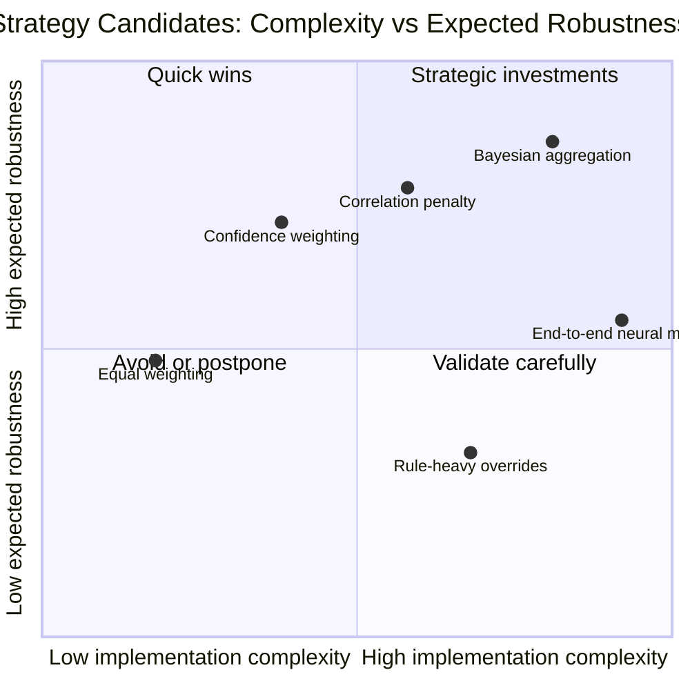
```mermaid
quadrantChart
    title Strategy Candidates: Complexity vs Expected Robustness
    x-axis Low implementation complexity --> High implementation complexity
    y-axis Low expected robustness --> High expected robustness
    quadrant-1 Strategic investments
    quadrant-2 Quick wins
    quadrant-3 Avoid or postpone
    quadrant-4 Validate carefully
    Equal weighting: [0.18, 0.48]
    Confidence weighting: [0.38, 0.72]
    Correlation penalty: [0.58, 0.78]
    Bayesian aggregation: [0.81, 0.86]
    End-to-end neural model: [0.92, 0.55]
    Rule-heavy overrides: [0.68, 0.32]
```

---

## Mermaid 9 — Git history

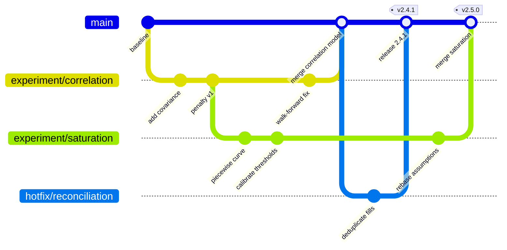
```mermaid
gitGraph
    commit id: "baseline"
    branch experiment/correlation
    checkout experiment/correlation
    commit id: "add covariance"
    commit id: "penalty v1"
    branch experiment/saturation
    checkout experiment/saturation
    commit id: "piecewise curve"
    commit id: "calibrate thresholds"
    checkout experiment/correlation
    commit id: "walk-forward fix"
    checkout main
    merge experiment/correlation id: "merge correlation model"
    branch hotfix/reconciliation
    checkout hotfix/reconciliation
    commit id: "deduplicate fills"
    checkout main
    merge hotfix/reconciliation id: "release 2.4.1" tag: "v2.4.1"
    checkout experiment/saturation
    commit id: "rebase assumptions"
    checkout main
    merge experiment/saturation id: "merge saturation" tag: "v2.5.0"
```

---

## Mermaid 10 — Portfolio composition

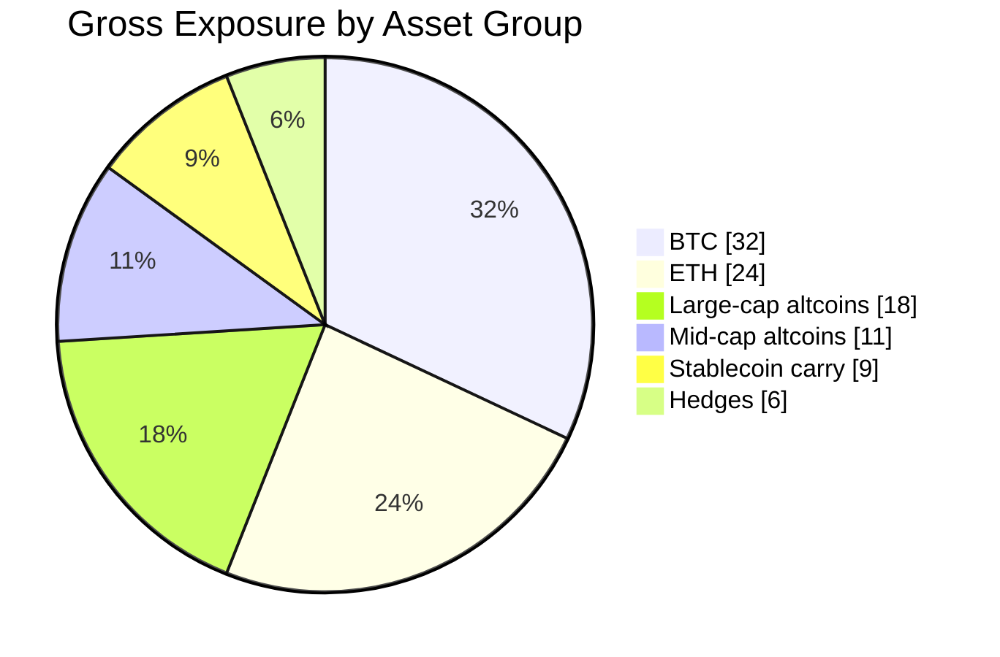
```mermaid
pie showData
    title Gross Exposure by Asset Group
    "BTC" : 32
    "ETH" : 24
    "Large-cap altcoins" : 18
    "Mid-cap altcoins" : 11
    "Stablecoin carry" : 9
    "Hedges" : 6
```

---

## Mermaid 11 — Model performance

This uses the newer `xychart-beta` syntax and may be unsupported in an older Mermaid renderer.

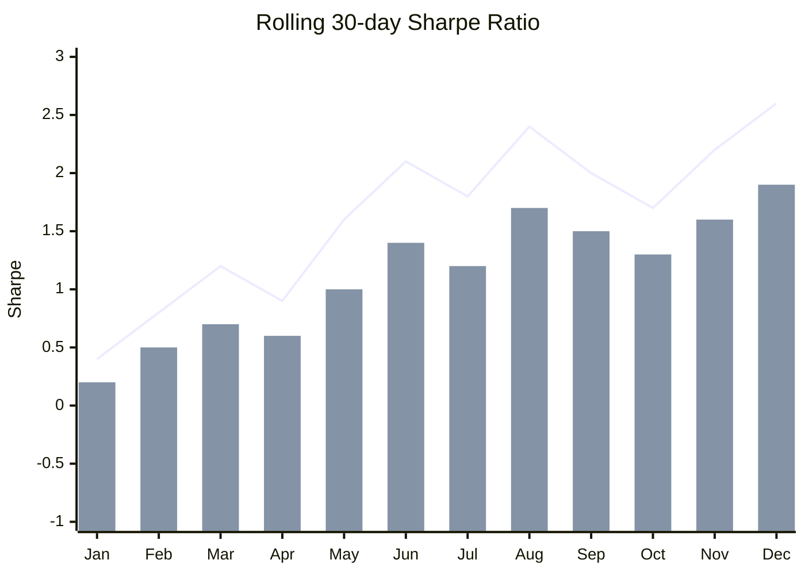
```mermaid
xychart-beta
    title "Rolling 30-day Sharpe Ratio"
    x-axis [Jan, Feb, Mar, Apr, May, Jun, Jul, Aug, Sep, Oct, Nov, Dec]
    y-axis "Sharpe" -1 --> 3
    line [0.4, 0.8, 1.2, 0.9, 1.6, 2.1, 1.8, 2.4, 2.0, 1.7, 2.2, 2.6]
    bar [0.2, 0.5, 0.7, 0.6, 1.0, 1.4, 1.2, 1.7, 1.5, 1.3, 1.6, 1.9]
```

---

## Mermaid 12 — User journey

Scores range from 1 (poor experience) to 5 (excellent experience), and each task can name one or more actors.

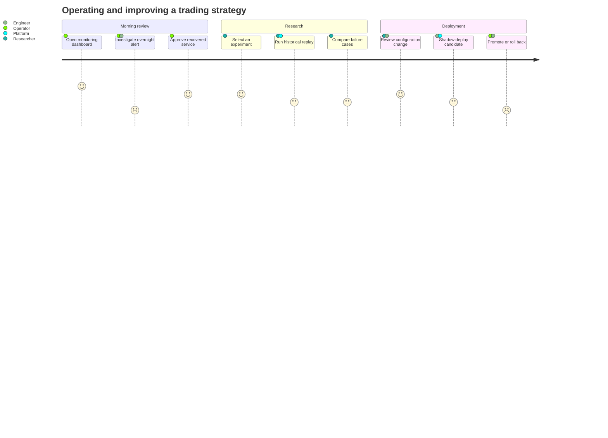
```mermaid
journey
    title Operating and improving a trading strategy
    section Morning review
      Open monitoring dashboard: 5: Operator
      Investigate overnight alert: 2: Operator, Engineer
      Approve recovered service: 4: Operator
    section Research
      Select an experiment: 4: Researcher
      Run historical replay: 3: Researcher, Platform
      Compare failure cases: 3: Researcher
    section Deployment
      Review configuration change: 4: Researcher, Engineer
      Shadow deploy candidate: 3: Engineer, Platform
      Promote or roll back: 2: Operator, Engineer
```

---

## Mermaid 13 — Project history timeline

Unlike a Gantt chart, a timeline emphasizes events rather than task durations.

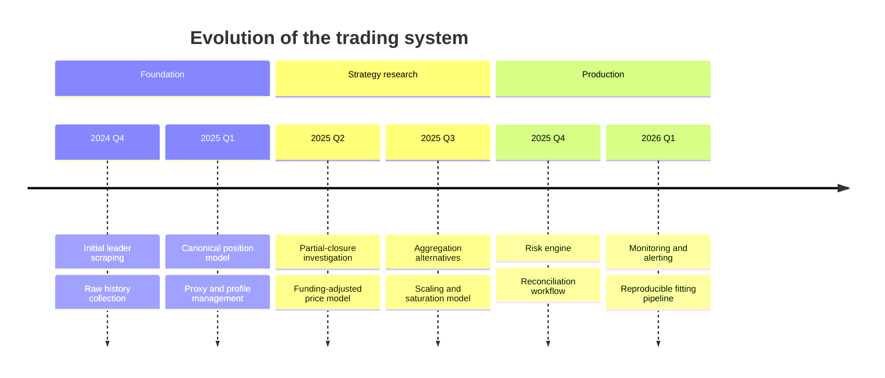
```mermaid
timeline
    title Evolution of the trading system
    section Foundation
      2024 Q4 : Initial leader scraping
              : Raw history collection
      2025 Q1 : Canonical position model
              : Proxy and profile management
    section Strategy research
      2025 Q2 : Partial-closure investigation
              : Funding-adjusted price model
      2025 Q3 : Aggregation alternatives
              : Scaling and saturation model
    section Production
      2025 Q4 : Risk engine
              : Reconciliation workflow
      2026 Q1 : Monitoring and alerting
              : Reproducible fitting pipeline
```

---

## Mermaid 14 — Capital-flow Sankey

Sankey syntax is essentially three-column CSV: source, destination, value.

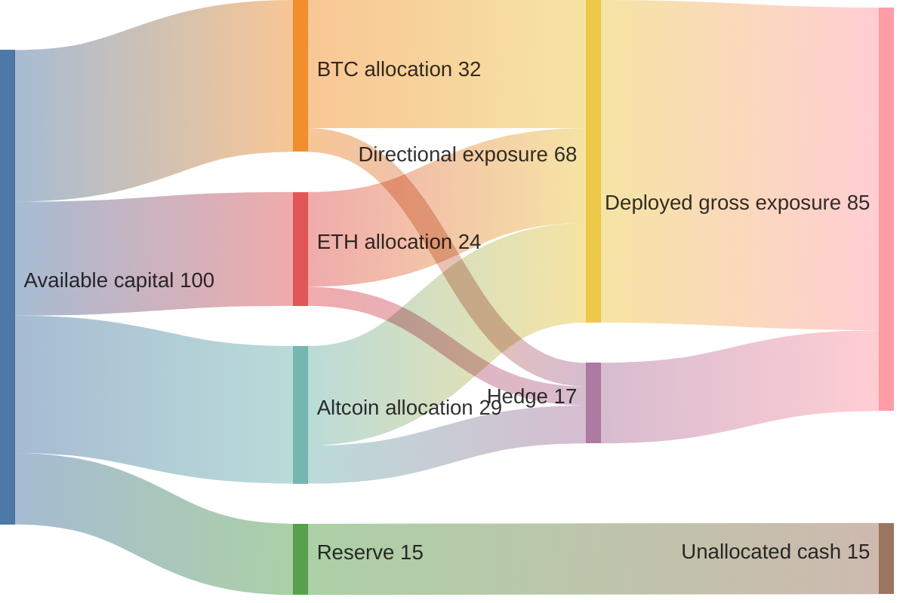
```mermaid
sankey-beta
Available capital,BTC allocation,32
Available capital,ETH allocation,24
Available capital,Altcoin allocation,29
Available capital,Reserve,15
BTC allocation,Directional exposure,27
BTC allocation,Hedge,5
ETH allocation,Directional exposure,20
ETH allocation,Hedge,4
Altcoin allocation,Directional exposure,21
Altcoin allocation,Hedge,8
Directional exposure,Deployed gross exposure,68
Hedge,Deployed gross exposure,17
Reserve,Unallocated cash,15
```

---

## Mermaid 15 — Requirements traceability

Requirement diagrams connect documented requirements to the components that satisfy, verify, refine, contain, copy, or derive them.

```mermaid
requirementDiagram
    requirement gross_limit {
        id: RISK-001
        text: Gross exposure shall not exceed configured maximum
        risk: high
        verifymethod: test
    }

    functionalRequirement kill_switch {
        id: RISK-002
        text: Operator can cancel all open orders
        risk: high
        verifymethod: demonstration
    }

    performanceRequirement reconciliation_latency {
        id: OPS-003
        text: Position drift is detected within sixty seconds
        risk: medium
        verifymethod: test
    }

    element risk_engine {
        type: software
        docref: src/risk/engine.py
    }

    element order_manager {
        type: software
        docref: src/execution/order_manager.py
    }

    element monitor {
        type: software
        docref: src/monitoring/reconciliation.py
    }

    risk_engine - satisfies -> gross_limit
    order_manager - satisfies -> kill_switch
    monitor - satisfies -> reconciliation_latency
    kill_switch - contains -> gross_limit
```

---

## Mermaid 16 — Block diagram

Block diagrams provide more explicit control over grid placement than ordinary flowcharts. This is a newer Mermaid family.

```mermaid
block-beta
    columns 3
    SCRAPE["Scraping"] PRE["Preprocessing"] SIGNAL["Signals"]
    STORE[("State store")] AGG{{"Aggregation"}} RISK{"Risk decision"}
    space EXEC[["Execution"]] space

    SCRAPE --> PRE
    PRE --> SIGNAL
    SIGNAL --> STORE
    STORE --> AGG
    AGG --> RISK
    RISK --> EXEC

    classDef ingest fill:#eef2ff,stroke:#4f46e5,color:#1e1b4b;
    classDef strategy fill:#ecfdf5,stroke:#059669,color:#064e3b;
    class SCRAPE,PRE,SIGNAL ingest
    class STORE,AGG,RISK,EXEC strategy
```

---

## Mermaid 17 — Kanban board

```mermaid
kanban
    backlog[Backlog]
        docmap[Map legacy slides]
        clh[Separate active and archived CLH work]
    active[In progress]
        markdown[Create Markdown documentation tree]
        diagrams[Convert architecture diagrams]
    review[Review]
        formulas[Verify mathematical notation]
    done[Done]
        playground[Create Mermaid feature playground]
```

---

## Mermaid 18 — Packet layout

Packet diagrams represent bit fields. They are useful for binary protocols, message headers, compact identifiers, and storage formats.

```mermaid
packet-beta
    0-3: "Version"
    4-7: "Event type"
    8-15: "Flags"
    16-31: "Payload length"
    32-63: "Leader identifier hash"
    64-95: "Unix timestamp"
    96-127: "Sequence number"
```

---

## Mermaid 19 — Architecture diagram

Architecture diagrams were introduced in Mermaid 11.1. They use groups, services, junctions, and directional service edges.

```mermaid
architecture-beta
    group ingest(cloud)[Ingestion]
    group strategy(cloud)[Strategy]
    group execution(cloud)[Execution]

    service watcher(server)[Watcher] in ingest
    service raw(database)[Raw Store] in ingest
    service aggregator(server)[Aggregator] in strategy
    service risk(server)[Risk Engine] in strategy
    service oms(server)[Order Manager] in execution
    service broker(internet)[Broker API] in execution

    watcher:R --> L:raw
    raw:R --> L:aggregator
    aggregator:R --> L:risk
    risk:R --> L:oms
    oms:R --> L:broker
```

---

## Mermaid 20 — Strategy radar chart

Radar diagrams require Mermaid 11.6 or later.

```mermaid
radar-beta
    title Strategy comparison
    axis ret["Return"], risk["Risk control"], robust["Robustness"], simple["Simplicity"], liquid["Liquidity"], explain["Explainability"]
    curve equal["Equal weight"]{6, 6, 7, 10, 8, 10}
    curve confidence["Confidence weighted"]{8, 7, 8, 7, 8, 8}
    curve bayes["Bayesian model"]{9, 8, 7, 3, 7, 4}
    max 10
    min 0
    showLegend true
```

---

## Mermaid 21 — Risk-budget treemap

Treemaps are a newer beta diagram type. Indentation defines hierarchy and numeric leaves determine area.

```mermaid
treemap-beta
    "Portfolio risk budget"
        "Directional"
            "BTC": 28
            "ETH": 20
            "Large-cap altcoins": 12
        "Relative value"
            "Pairs": 10
            "Funding carry": 8
        "Protection"
            "Market hedges": 12
            "Tail hedges": 5
        "Reserve": 5
```

---

## Mermaid 22 — C4 system context

C4 diagrams describe a software system at progressively deeper levels: context, containers, components, and deployment. Mermaid labels this family experimental.

```mermaid
C4Context
    title System Context — Leader-following Trading Platform

    Person(operator, "Operator", "Reviews alerts and controls deployments")
    Person(researcher, "Researcher", "Develops and evaluates strategies")

    System(platform, "Trading Platform", "Observes leaders, constructs targets, and executes trades")

    System_Ext(bybit, "Bybit", "Leader data, market data, and order execution")
    System_Ext(alerting, "Notification Service", "Delivers operational alerts")
    SystemDb_Ext(archive, "Research Archive", "Historical snapshots and backtest results")

    Rel(operator, platform, "Operates and configures")
    Rel(researcher, platform, "Runs experiments")
    Rel(platform, bybit, "Reads data and submits orders", "HTTPS")
    Rel(platform, alerting, "Publishes alerts")
    Rel(platform, archive, "Reads and writes datasets")
```

---

## Compatibility checklist

Use this after opening the preview:

- [ ] Headings appear in the outline and table of contents links work.
- [ ] Tables align correctly.
- [ ] Task-list checkboxes render.
- [ ] Blockquotes and callouts render acceptably.
- [ ] Inline and display mathematics render.
- [ ] `<details>` opens and closes.
- [ ] The complex flowchart renders without a parser error.
- [ ] Sequence, state, class, and ER diagrams render.
- [ ] Gantt and mind-map diagrams render.
- [ ] Quadrant and Git diagrams render.
- [ ] Pie and XY charts render.
- [ ] User journey and timeline render.
- [ ] Sankey and requirements diagrams render.
- [ ] Block, Kanban, packet, and architecture diagrams render.
- [ ] Radar and treemap diagrams render.
- [ ] C4 system context renders.
- [ ] Syntax highlighting works for Python, YAML, JSON, and Bash.
- [ ] Colored (`\color`/`\textcolor`) and boxed (`\boxed`) math render.
- [ ] Display math inside table cells renders.
- [ ] The merged/styled HTML table (colspan, rowspan, cell shading) renders.
- [ ] Sized `` and manual HTML callout `<div>`/`<span>` render.
- [ ] The ASCII box-drawing diagram stays aligned in a monospace font.

## Conclusion

If the features you care about render correctly, plain Markdown plus VS Code already provides a strong graphical, agent-readable documentation environment. Unsupported decorative features can be omitted without changing the underlying documentation architecture.
