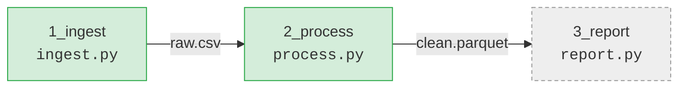

<!-- For a human, read years later by someone who has forgotten everything. Diagrams, not prose (prose ≤ ~150 words). Entities only: files, folders, arrows, status — never a rule or a tunable number (those live in AGENTS.md). -->
<!-- If this project has a README.html, replace this whole file with the short variant at the bottom. -->

# <project-name>

**<One line: what this does, for whom.>**

## The big picture



<sub>green = live · red = broken · dashed = planned</sub>

## Folder map

```
<project-name>/
├── AGENTS.md          rules for agents (CLAUDE.md → AGENTS.md)
├── TODO.md            open work, by priority
├── doc/               companion files for the code
└── src/               …
```

---
Rules for agents: [`AGENTS.md`](AGENTS.md) · Open work: [`TODO.md`](TODO.md)

<!-- ===== Short variant, when a README.html exists =====
# <project-name>

**<One line: what this does.>** The visual overview is [`README.html`](README.html) — open it in a browser (`open README.html`).

Rules for agents: [`AGENTS.md`](AGENTS.md) · Open work: [`TODO.md`](TODO.md)
-->
